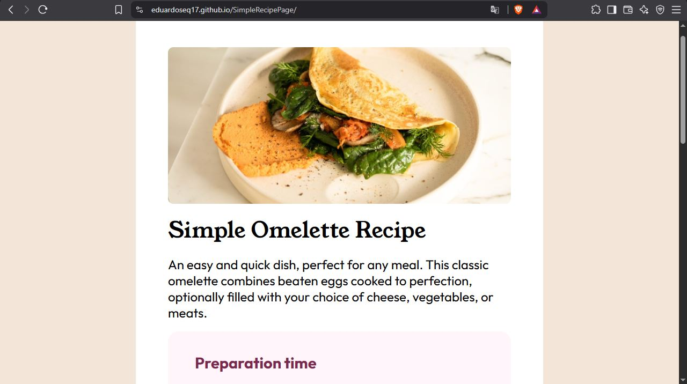

# Frontend Mentor - Recipe Page Solution

This is my solution to the **Recipe Page** challenge on Frontend Mentor. The goal of this project was to recreate the provided design using semantic HTML and modern CSS while building a responsive layout that closely matches the original design.

## Overview

### Screenshot

### Links

- **Solution URL:** https://github.com/eduardoseq17/SimpleRecipePage
- **Live Site URL:** https://eduardoseq17.github.io/SimpleRecipePage

## Built with

- Semantic HTML5
- CSS Custom Properties (Variables)
- Flexbox
- Responsive design with Media Queries
- Custom local fonts using `@font-face`
- Mobile-first workflow

## What I learned

While building this project, I practiced and improved several front-end skills:

- Structuring content with semantic HTML elements such as headings, lists, tables, and sections.
- Creating responsive layouts using a mobile-first approach and media queries.
- Styling ordered and unordered lists while maintaining proper spacing and alignment.
- Building and styling tables with semantic HTML and CSS.
- Using CSS custom properties to keep styles organized and easier to maintain.
- Working with local fonts through `@font-face`.
- Organizing CSS into reusable, readable, and maintainable sections.

## Continued development

In future projects, I would like to continue improving my:

- Responsive design techniques for different screen sizes.
- CSS organization and component reusability.
- Accessibility best practices.
- JavaScript fundamentals to create more interactive user interfaces.

## AI Collaboration

I used ChatGPT as a learning assistant to review my HTML and CSS, receive feedback on semantic structure, understand CSS concepts such as media queries, lists, and tables, and improve the overall organization of my code.

## Author

- GitHub - https://github.com/eduardoseq17
- Frontend Mentor - https://www.frontendmentor.io/profile/eduardoseq17
